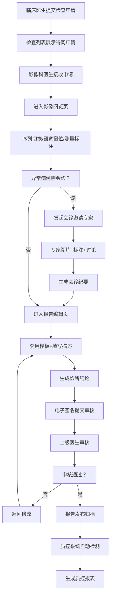

## 1. 产品概述

医院 PACS（影像归档与通信系统）Web 阅片系统，为影像科医生、临床医生和会诊人员提供数字化医学影像阅览、报告撰写、远程会诊与质控管理的一体化工作平台。解决传统胶片阅片效率低、报告不规范、会诊困难、质控缺失等痛点，提升诊断精度与协作效率。

## 2. 核心功能

### 2.1 用户角色

| 角色 | 注册方式 | 核心权限 |
|------|----------|----------|
| 影像科医生 | 系统分配 | 全量阅览、测量标注、报告撰写与审核、模板维护、质控检查 |
| 临床医生 | 系统分配 | 检查申请、影像阅览、会诊发起、报告查看 |
| 会诊专家 | 系统分配/邀请链接 | 影像阅览、会诊讨论、标注建议、报告审阅 |
| 系统管理员 | 系统分配 | 用户管理、模板配置、统计分析、系统设置 |

### 2.2 功能模块

1. **检查列表页**：患者/部位/状态多维筛选、检查申请接收、检查详情快速查看
2. **影像阅览页**：序列切换、窗宽窗位调节、缩放/旋转/平移、长度/角度/面积测量、文字/箭头标注、多序列同步对比
3. **报告编辑页**：报告模板套用、结构化描述插入、AI 辅助结论生成、电子签名、多级审核流程
4. **会诊协作页**：会诊发起、多专家邀请、实时留言讨论、关键图像标记、会诊纪要导出
5. **质控页面**：漏报自动检测、报告时效监控、报告质量评分、质控统计报表
6. **共享归档页**：DICOM/PNG/PDF 多格式导出、临时访问链接生成、权限有效期设置、归档查询
7. **统计设置页**：医生工作量统计、报告效率分析、模板库维护、个人偏好设置

### 2.3 页面详情

| 页面名称 | 模块名称 | 功能描述 |
|-----------|----------|----------|
| 检查列表 | 顶部导航栏 | 用户信息、消息通知、快速搜索、页面切换 |
| 检查列表 | 筛选区 | 患者姓名/ID搜索、检查部位选择、检查状态(待阅/阅片中/已报告/已审核)、检查日期范围 |
| 检查列表 | 检查列表 | 表格展示(患者信息、检查号、部位、 modality、申请时间、状态、操作)、分页、排序 |
| 检查列表 | 申请接收面板 | 新发申请提醒弹窗、快速接收/拒绝、申请详情预览 |
| 影像阅览 | 左侧序列树 | 检查-序列层级结构、缩略图预览、序列信息元数据 |
| 影像阅览 | 中央阅片区 | 1x1/2x2/3x3/4x4 布局切换、当前影像显示、标注叠加层 |
| 影像阅览 | 顶部工具栏 | 窗宽窗位预设(肺窗/纵隔窗/骨窗/脑窗/软组织窗)、自定义窗宽窗位滑块、重置 |
| 影像阅览 | 左侧工具栏 | 缩放(放大镜/滚轮)、平移、旋转(90°/180°/左右翻转)、序列滚动播放 |
| 影像阅览 | 右侧工具栏 | 长度测量、角度测量、面积测量、CT值测量、箭头标注、文字标注、标注删除 |
| 影像阅览 | 对比功能 | 多序列并排对比、同步缩放平移、同步窗宽窗位 |
| 影像阅览 | 底部信息栏 | 当前切片数/总切片、像素间距、层厚、检查信息、患者ID脱敏显示 |
| 报告编辑 | 左侧模板库 | 按部位/Modality 分类的报告模板树、模板搜索、常用模板收藏 |
| 报告编辑 | 中央编辑区 | 结构化编辑器、所见即所得、历史版本对比 |
| 报告编辑 | 描述插入面板 | 影像所见预设短语(正常/异常表现)、快捷插入、拖拽排序 |
| 报告编辑 | 结论生成 | AI 辅助结论建议、手动修改、结论样式规范检查 |
| 报告编辑 | 签名审核 | 电子签名(密码/指纹/证书)、提交审核、一级/二级审核意见栏 |
| 报告编辑 | 右侧关联影像 | 关联检查缩略图、快速跳转阅览、关键图引用插入 |
| 会诊协作 | 会诊列表 | 进行中/已结束的会诊列表、会诊状态(等待中/讨论中/已总结) |
| 会诊协作 | 发起会诊 | 选择检查/序列、添加专家、设置会诊时间、选择会诊类型(普通/紧急) |
| 会诊协作 | 讨论区 | 实时消息流、文字/语音/图片消息、专家回复标记 |
| 会诊协作 | 关键图标记 | 在影像上标记关键帧、添加批注说明、标记列表汇总 |
| 会诊协作 | 会诊纪要 | 自动汇总讨论要点、专家意见整理、纪要导出PDF/Word |
| 质控 | 漏报检测 | AI+规则自动检测可疑漏报病例、待复核列表、人工复核确认 |
| 质控 | 时效监控 | 各环节(接收-阅片-报告-审核)耗时统计、超期预警、时效SLA达成率 |
| 质控 | 质量评分 | 报告完整性评分、诊断准确度评分、综合评分排名 |
| 质控 | 质控报表 | 日/周/月质控统计、趋势图、导出功能 |
| 共享归档 | 影像导出 | 单张/序列/全检查导出、格式选择(DICOM/PNG/JPG/PDF)、压缩打包 |
| 共享归档 | 链接分享 | 生成带密码/验证码的临时访问链接、有效期设置(1h/1d/7d/30d)、访问次数限制 |
| 共享归档 | 归档查询 | 按时间/患者/检查号查询归档记录、归档状态追踪、下载记录 |
| 共享归档 | 权限管理 | 链接权限(仅查看/可下载)、访问日志、撤销分享 |
| 统计设置 | 工作量统计 | 按医生/科室/时间维度的检查数、报告数、审核数统计、图表可视化 |
| 统计设置 | 效率分析 | 平均阅片时长、平均报告时长、审核通过率、环比同比分析 |
| 统计设置 | 模板维护 | 新增/编辑/删除报告模板、模板分类管理、模板版本控制、共享范围设置 |
| 统计设置 | 个人设置 | 阅片偏好(默认布局、窗宽窗位预设)、快捷键设置、消息通知偏好 |

## 3. 核心流程

### 3.1 影像诊断主流程

影像科医生登录系统 → 进入检查列表筛选待阅检查 → 接收申请 → 打开影像阅览页 → 调节窗宽窗位/测量/标注 → 切换到报告编辑 → 套用模板并填写描述 → 生成结论 → 电子签名 → 提交审核 → 上级医生审核 → 报告发布

### 3.2 远程会诊流程

临床医生/影像科医生 → 选择疑难病例 → 发起会诊 → 邀请多位专家 → 专家查看影像并标注关键图 → 专家在线留言讨论 → 主持人整理会诊纪要 → 结束会诊并导出报告

### 3.3 Mermaid 流程图

## 4. 用户界面设计

### 4.1 设计风格

- **主色调**：深蓝科技感 (#0A2540) + 医疗蓝 (#2563EB)，辅以青色强调 (#06B6D4)
- **辅助色**：成功绿 (#10B981)、警告黄 (#F59E0B)、错误红 (#EF4444)
- **背景色**：深灰 (#111827) 用于阅片区（减少眩光）、浅灰 (#F8FAFC) 用于列表区
- **按钮风格**：圆角 6px、轻微投影、hover 微抬升动效；主操作实心、次操作描边
- **字体方案**：标题使用 "Noto Sans SC Medium"，正文使用 "Noto Sans SC Regular"，数字使用 "JetBrains Mono" 保证等宽对齐
- **布局风格**：专业医疗工作台风格，左侧导航栏 + 顶部状态栏 + 中央主工作区 + 右侧辅助面板；阅片区最大化，深色模式优先
- **图标风格**：线性图标，2px 描边，统一使用 24px 尺寸；状态图标使用实心填充增强辨识度
- **视觉细节**：玻璃拟态面板（backdrop-blur）、精致分割线、微动效过渡、信息密度适中不拥挤

### 4.2 页面设计概览

| 页面名称 | 模块名称 | UI 元素 |
|-----------|----------|---------|
| 检查列表 | 筛选区 | 深色背景搜索框、胶囊形筛选标签、日期范围选择器带日历弹窗 |
| 检查列表 | 数据表格 | 斑马纹行、状态色块标签、hover 高亮、操作按钮组（接收/阅览/报告） |
| 检查列表 | 申请弹窗 | 右侧抽屉式面板、患者信息卡、申请详情、底部操作按钮 |
| 影像阅览 | 序列树 | 可折叠树状结构、序列卡片带缩略图、选中态蓝色描边、滚动懒加载 |
| 影像阅览 | 阅片区 | 纯黑背景、中央影像、四角叠加信息（左上：患者ID脱敏，右上：序列信息，左下：当前帧数，右下：比例尺） |
| 影像阅览 | 工具栏 | 图标按钮组、分隔线分组、tooltip 显示快捷键、激活态蓝色底+白色图标 |
| 影像阅览 | 标注层 | 半透明青色测量线、黄色标注标签、拖拽控制点、测量数值随移动更新 |
| 报告编辑 | 模板库 | 分类 Tab、模板卡片（标题+部位标签+使用次数）、搜索框、收藏星标 |
| 报告编辑 | 编辑区 | 富文本编辑器、分段可折叠、占位提示文字、右侧字数统计 |
| 报告编辑 | 签名区 | 审核时间线、签名按钮带密码弹窗、审核状态徽章 |
| 会诊协作 | 讨论区 | 聊天气泡（左/右对齐区分发言人）、专家头衔标签、时间戳、已读标记 |
| 会诊协作 | 关键图 | 缩略图网格、标记序号徽章、点击放大查看标注 |
| 质控 | 时效监控 | KPI 卡片（完成率/平均时长/超期数）、进度条带阈值颜色、甘特图展示各环节耗时 |
| 共享归档 | 链接分享 | 卡片式链接展示、复制按钮、二维码生成、有效期倒计时条 |
| 统计设置 | 图表区 | ECharts 图表组件（柱状图/折线图/饼图）、图表标题+下载按钮、网格布局 |

### 4.3 响应式设计

- **设计优先**：Desktop-first，最小支持 1366x768 分辨率
- **大屏优化**：支持 2K/4K 显示器，阅片区占比最大化，工具栏图标在超高分辨率下保持清晰
- **平板适配**：侧边栏可折叠收起，工具栏改为图标-only 模式
- **触屏优化**：阅片支持双指缩放、单指平移；按钮最小触控区 44x44px
- **不支持手机端**：医学影像诊断需要大屏高分辨率，手机端仅提供检查列表查询和报告查看功能

### 4.4 交互与动效

- **页面切换**：内容区使用淡入 + 轻微位移动效（opacity 0→1, translateY 8px→0, 200ms ease-out）
- **面板展开**：侧边栏/抽屉使用宽度过渡动画（250ms cubic-bezier(0.4,0,0.2,1)）
- **按钮反馈**：hover 时 scale(1.02) + 阴影加深；click 时 scale(0.98) 回弹
- **影像操作**：窗宽窗位调节有实时数值反馈，测量完成时线段端点有 pulse 动画标记
- **消息通知**：右上角 Toast 通知，滑入动画，自动消失（紧急类型需手动关闭）
- **加载状态**：影像加载时显示骨架屏 + 进度条百分比，序列加载完成时淡入
