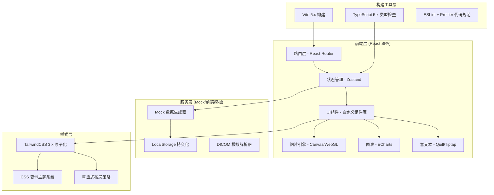
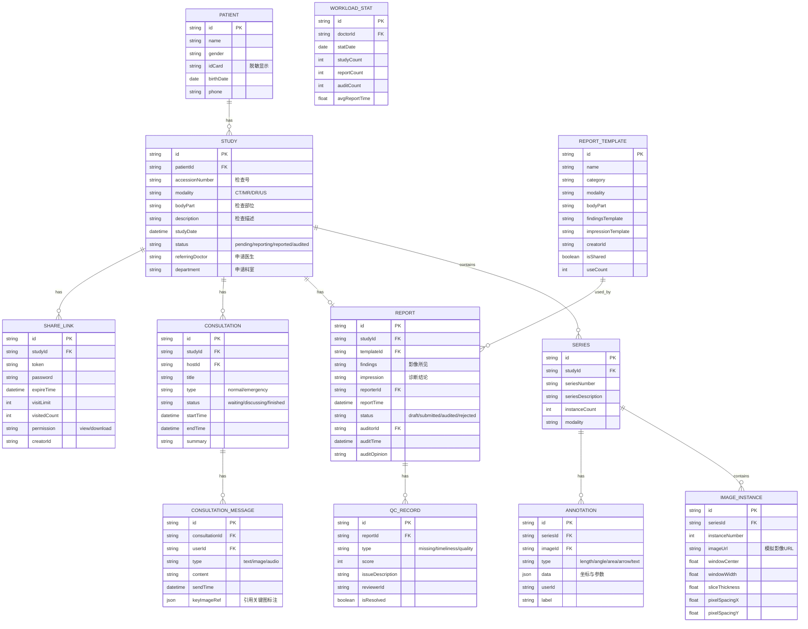

## 1. 架构设计



## 2. 技术栈说明

- **前端框架**：React 18.x (Hooks API + 函数组件)
- **构建工具**：Vite 5.x（快速 HMR，支持 TypeScript）
- **语言**：TypeScript 5.x（严格类型检查模式）
- **样式方案**：TailwindCSS 3.x + PostCSS + 自定义 CSS 变量
- **路由**：React Router v6（嵌套路由 + 懒加载）
- **状态管理**：Zustand 4.x（轻量级，无 Provider 嵌套地狱）
- **图表可视化**：ECharts 5.x（统计页面图表）
- **图标库**：Lucide React（线性风格医疗图标）
- **富文本编辑**：Tiptap（基于 ProseMirror，结构化报告编辑）
- **阅片引擎**：自研 Canvas 2D + WebGL 混合方案（窗宽窗位、缩放、旋转、标注）
- **日期处理**：date-fns（轻量日期格式化）
- **后端**：无后端，使用 Mock 数据 + LocalStorage 模拟持久化

## 3. 路由定义

| 路由路径 | 页面名称 | 页面说明 | 权限 |
|---------|----------|----------|------|
| / | 检查列表页（首页） | 默认跳转检查列表 | 所有角色 |
| /studies | 检查列表页 | 检查申请筛选与接收 | 影像科/临床医生 |
| /viewer/:studyId | 影像阅览页 | 阅片、测量、标注、对比 | 所有角色 |
| /report/:studyId | 报告编辑页 | 报告撰写、签名、审核 | 影像科医生 |
| /consultation | 会诊协作页 | 会诊列表、讨论区 | 所有角色 |
| /consultation/:id | 会诊详情页 | 单场会诊讨论与标记 | 会诊参与人 |
| /quality | 质控页面 | 漏报检测、时效监控 | 质控员/主任 |
| /archive | 共享归档页 | 影像导出、链接分享 | 所有角色 |
| /settings | 统计设置页 | 工作量、模板维护、偏好 | 影像科医生/管理员 |

## 4. 数据模型定义

### 4.1 Mermaid ER 图



### 4.2 类型定义文件结构

```
types/
├── index.ts              # 统一导出
├── patient.ts            # 患者信息类型
├── study.ts              # 检查/序列/影像实例类型
├── report.ts             # 报告与模板类型
├── annotation.ts         # 标注类型
├── consultation.ts       # 会诊类型
├── quality.ts            # 质控类型
├── statistic.ts          # 统计类型
└── share.ts              # 分享归档类型
```

## 5. 前端目录结构

```
src/
├── assets/               # 静态资源
│   ├── fonts/            # Noto Sans SC / JetBrains Mono
│   ├── icons/            # SVG 图标
│   └── mock-images/      # 模拟医学影像
├── components/           # 通用组件
│   ├── ui/               # 基础 UI：Button/Input/Modal/Drawer/Table/Tabs/Tooltip
│   ├── layout/           # Layout/Sidebar/Topbar/Content
│   └── paca/             # PACS 专用组件
│       ├── StudyFilter/
│       ├── StudyTable/
│       ├── SeriesTree/
│       ├── ViewerCanvas/
│       ├── ViewerToolbar/
│       ├── WindowLevelSlider/
│       ├── AnnotationLayer/
│       ├── TemplateLibrary/
│       ├── ReportEditor/
│       ├── SignatureModal/
│       ├── ChatPanel/
│       ├── KeyImageGrid/
│       ├── KpiCard/
│       ├── ShareCard/
│       └── WorkloadChart/
├── pages/                # 页面级组件
│   ├── StudyListPage.tsx
│   ├── ViewerPage.tsx
│   ├── ReportPage.tsx
│   ├── ConsultationListPage.tsx
│   ├── ConsultationDetailPage.tsx
│   ├── QualityPage.tsx
│   ├── ArchivePage.tsx
│   └── SettingsPage.tsx
├── stores/               # Zustand stores
│   ├── authStore.ts
│   ├── studyStore.ts
│   ├── viewerStore.ts
│   ├── reportStore.ts
│   ├── consultationStore.ts
│   ├── qualityStore.ts
│   └── settingsStore.ts
├── hooks/                # 自定义 hooks
│   ├── useViewerEngine.ts
│   ├── useAnnotation.ts
│   ├── useWindowLevel.ts
│   └── useKeyboardShortcuts.ts
├── utils/                # 工具函数
│   ├── dicom.ts          # DICOM 解析模拟
│   ├── viewer.ts         # 阅片计算（窗宽窗位、坐标转换）
│   ├── format.ts         # 格式化函数
│   └── export.ts         # 导出工具
├── mock/                 # Mock 数据
│   ├── patients.ts
│   ├── studies.ts
│   ├── templates.ts
│   ├── consultations.ts
│   └── quality.ts
├── types/                # TypeScript 类型定义
├── App.tsx
├── main.tsx
└── index.css
```

## 6. 核心阅片引擎技术方案

### 6.1 影像渲染管线

```
原始模拟影像(PNG/JPG)
    ↓
预计算 LUT 表 (窗宽窗位映射)
    ↓
Canvas 2D Context 绘制
    ↓
Viewport Transform (平移/缩放/旋转矩阵)
    ↓
标注层叠加 (SVG Overlay)
    ↓
四角信息层 (DOM Overlay)
```

### 6.2 窗宽窗位算法

```typescript
// 线性窗宽窗位转换
function applyWindowLevel(
  pixelValue: number,
  windowCenter: number,
  windowWidth: number
): number {
  const min = windowCenter - windowWidth / 2;
  const max = windowCenter + windowWidth / 2;
  if (pixelValue <= min) return 0;
  if (pixelValue >= max) return 255;
  return Math.round(((pixelValue - min) / windowWidth) * 255);
}
```

### 6.3 标注坐标系统

- 使用**世界坐标系**（DICOM 像素坐标）存储标注数据
- 渲染时通过 Viewport 矩阵转换到屏幕坐标
- 保证缩放/旋转后标注位置精确跟随

## 7. 构建与部署配置

### 7.1 Vite 配置要点

- `resolve.alias`: `@` → `src/`
- `server.port`: 5173
- `build.target`: ES2019
- `build.chunkSizeWarningLimit`: 1000KB
- `optimizeDeps`: 预打包 ECharts 等大依赖

### 7.2 Tailwind 配置

- `content`: 扫描 `src/**/*.{ts,tsx}`
- 自定义色板扩展医疗蓝主题
- 扩展字体家族配置
- 自定义 boxShadow / borderRadius
- 添加暗色模式 (`class` 策略)

### 7.3 TypeScript 配置

- `strict: true` 开启所有严格检查
- `noImplicitAny: true`
- `noUnusedLocals: true`
- `baseUrl` + `paths` 配置 `@/*` 别名

## 8. 性能优化策略

| 优化点 | 方案 |
|--------|------|
| 影像加载 | 序列懒加载 + Web Worker 预解码 + LRU 缓存 |
| 阅片渲染 | 离屏 Canvas 预渲染 + requestAnimationFrame 节流 |
| 标注性能 | SVG 虚拟化（仅渲染可见范围标注） |
| 表格 | 虚拟滚动（react-window）支持 10000+ 行 |
| 首屏加载 | React Router 路由级代码分割 + Suspense |
| 图表 | ECharts 按需引入图表类型，不加载全量 |
| 状态更新 | Zustand selector 避免不必要重渲染 |
